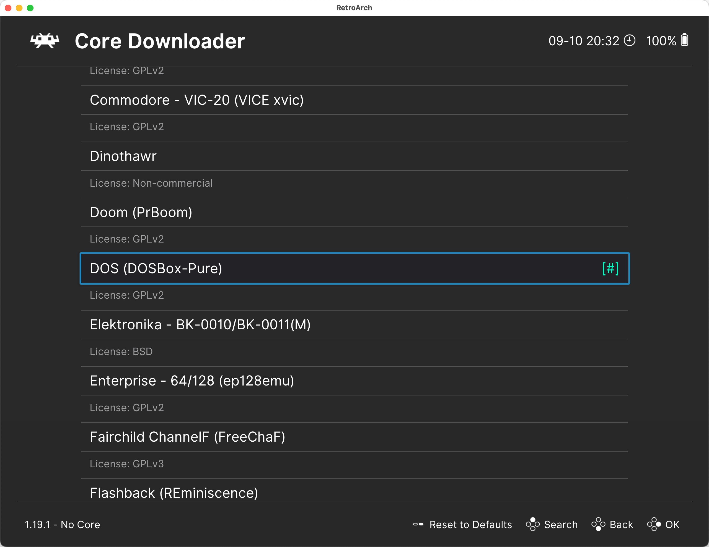

# Installing DOSBox Pure

The easiest way to install DOSBox Pure is through the built-in core downloader in RetroArch. To do this:

1. Open the `Main Menu` in RetroArch.
2. Navigate to the `Online Updater` section.
3. Select `Core Downloader`.
4. Find `DOSBox Pure` in the list and press `Enter` to install it.

This will install the latest stable version of DOSBox Pure available in the RetroArch repository.

In some cases, you may need to install a different core build, such as a test version from the developer.

To do this:

1. Obtain a precompiled core file or build it yourself from source.
2. Place the core file in the `Cores` folder (see [System Folders](../retroarch/folders.md#cores)).
3. The file should be named `dosbox_pure_libretro.`, with the extension depending on your operating system:
   - `dll` for Windows
   - `so` for Linux
   - `dylib` for macOS

After this, DOSBox Pure will be available in the list of cores in RetroArch, and you can proceed to its [configuration](./settings.md).