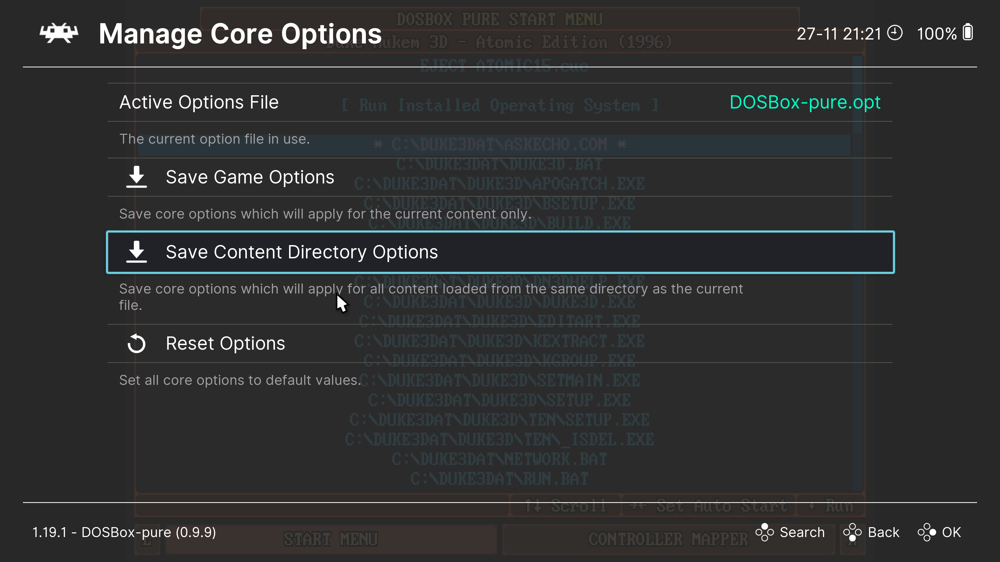

# Per-Game Settings

When you configure the `DOSBox Pure` core, such as adjusting cycle counts or selecting a video mode, these settings apply to all games by default.

However, you can save settings for each game individually.

To do this, open the `Quick Menu` during gameplay (`F1`), go to `Core Options` → `Manage Core Options`.

Here, you can see which configuration file is currently being used for the game. By default, this is the `DOSBox-pure.opt` file.

To save settings for the current game, select `Save Game Options`. The current settings will then be saved in a file named after the game (e.g., `Duke3D.opt`) in the [Configuration Files folder](../retroarch/folders.md#configuration-files).

To delete the settings for the current game, choose `Remove Game Options`.

You can also save settings for an entire folder of games. This is useful if you’ve organized your games into folders corresponding to different computer generations (e.g., `8088`, `286`, `386`, etc.). To do this, use the `Save Content Directory Options` option.