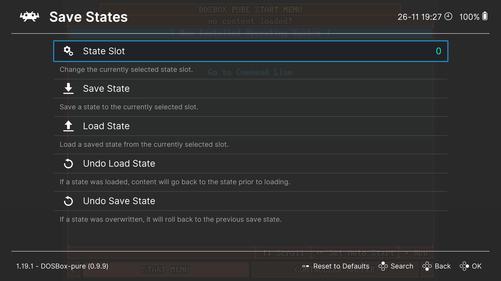

# Save and Load

When running games through `DBP`, there are two ways to save and load your progress:

1. Use the standard `Save/Load State` feature available in `RetroArch`.
2. Save your progress using the game's built-in save system, where `DOSBox Pure` will save all changes made to the `C:` drive.

It is strongly discouraged to combine these two methods. Let's look at each method in detail.

## Saving and Loading Game State with Save/Load State

This is a standard `RetroArch` feature that allows you to save the current state of the game and load it later.  
It works not only with `DOSBox Pure` but also with other emulators.

You have access to multiple save slots, which can be switched in the `Quick Menu` by pressing `F1`, then selecting `Save States` → `State Slot`.

In the same `Save States` menu, you will find the `Save State` and `Load State` options to save the current game state and load a saved state.

You can also assign hotkeys for these actions in the `Input` settings (see [Keyboard Controls](../retroarch/keybinds.md)).

By default, `F2` and `F4` are used for saving and loading states.

## Saving Changes to the `C:` Drive

Most DOS games have their own save systems that write progress to the `C:` drive.

If you launched the game from a `.zip` archive or a disk image, all changes for that game will be saved in a separate archive located in the [Save Files](../retroarch/folders.md#save-files) folder.  
The name of this archive will match the name of the game archive exactly.

If needed, you can open this save archive to inspect the files written to the `C:` drive.

Keep in mind that **all** changes written to the `C:` drive after starting the `DOSBox Pure` core are saved in this archive. This includes not only game saves but also any other files the game writes, such as configuration files, logs, etc.

> [!IMPORTANT]  
> If the game was launched from a folder with extracted game files instead of an archive, all changes will be saved directly to that folder instead of a separate archive.