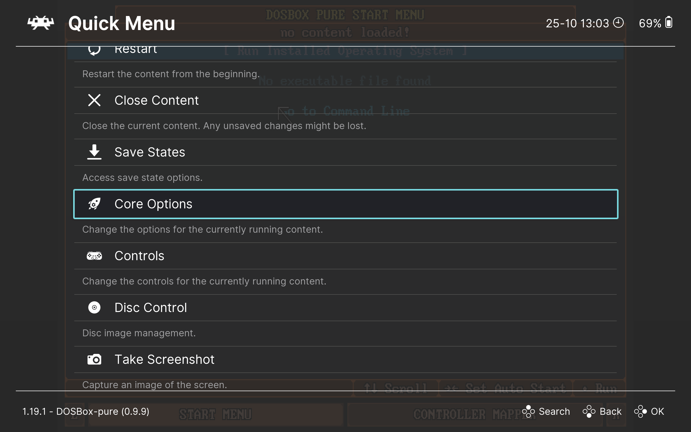

# DOSBox Pure Settings

You can access the `DBP` settings menu in two ways:

1. At any time during gameplay.
2. By starting the `DBP` core without a game (from the RetroArch main menu, select `Load Core` → `DOSBox Pure` → `Start Core`).

In both cases, you first need to open the RetroArch in-game menu (`Quick Menu`) by pressing `F1` on your keyboard (make sure to disable `Game Focus` if it’s enabled). Then, select the `Core Options` section.

> [!TIP]  
> If you accidentally return to the RetroArch main menu, you can re-enter the in-game menu by selecting the `Quick Menu` option.

Let’s take a closer look at all the available settings:

- [Emulation Settings](./settings/emulation.md)
- [Input Settings](./settings/input.md)
- [Performance Settings](./settings/performance.md)
- [Video Settings](./settings/video.md)
- [System Settings](./settings/system.md)
- [Audio Settings](./settings/audio.md)