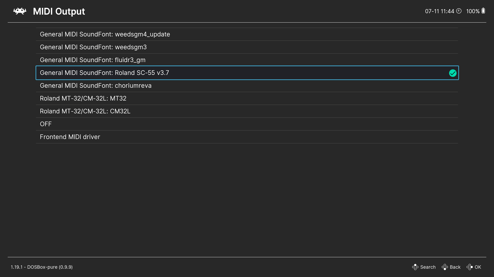

# Audio Settings

## Audio Sample Rate

Specifies the audio sampling rate. It is best to leave it at the default value of `48000`.

## SoundBlaster Settings

Configures [SoundBlaster](https://en.wikipedia.org/wiki/Sound_Blaster) parameters: `Port`, `IRQ`, and `DMA`. The default values are sufficient for most cases, but you can customize them if needed. Make sure to remember these settings as they may be required when configuring sound in games.

## MIDI Output

Configures MIDI output.

### OFF

Disables MIDI output.

### Frontend MIDI Driver

Uses the MIDI device selected in RetroArch settings.

### SoundFont

Uses a [SoundFont file](https://en.wikipedia.org/wiki/SoundFont) for MIDI playback. SoundFont files must have a `.sf2` extension and be placed in the [System/BIOS](../../retroarch/folders.md#systembios) folder, after which they will appear in this menu.

You can download SoundFont files, for example, from [here](https://www.philscomputerlab.com/general-midi-and-soundfonts.html).

### Roland MT-32

Uses [Roland MT-32](https://en.wikipedia.org/wiki/Roland_MT-32) emulation for MIDI playback. You must place MT-32 ROM files in the [System/BIOS](../../retroarch/folders.md#systembios) folder.

You will need the files `MT32_CONTROL.ROM` and `MT32_PCM.ROM`, which can be found online.

## SoundBlaster Type

Specifies the type of emulated SoundBlaster card, such as `SoundBlaster 16` or `SoundBlaster Pro`.

## SoundBlaster Adlib/FM Mode

Defines the emulation mode for [AdLib](https://en.wikipedia.org/wiki/Ad_Lib,_Inc.#AdLib_Gold_1000_(1992) or [FM synthesis](https://en.wikipedia.org/wiki/Frequency_modulation_synthesis). This determines the type of [OPL chip](https://en.wikipedia.org/wiki/List_of_sound_chips#Frequency_modulation_(FM)_synthesis) being emulated.

When set to `Auto`, the mode is chosen automatically based on the selected SoundBlaster type.

## SoundBlaster Adlib Provider

Selects the AdLib/FM synthesis emulator to use: the default emulator or [Nuked OPL3](https://github.com/nukeykt/Nuked-OPL3).

## Enable Gravis Ultrasound

Enables emulation of the [Gravis Ultrasound](https://en.wikipedia.org/wiki/Gravis_UltraSound) sound card.

Gravis Ultrasound parameters:

- Port: `0x240`
- IRQ: `5`
- DMA: `3`

## Enable Tandy Sound Device

Enables emulation of the [Tandy](https://en.wikipedia.org/wiki/Tandy_1000) sound card.

## Swap Stereo Channels

Swaps the left and right audio channels.