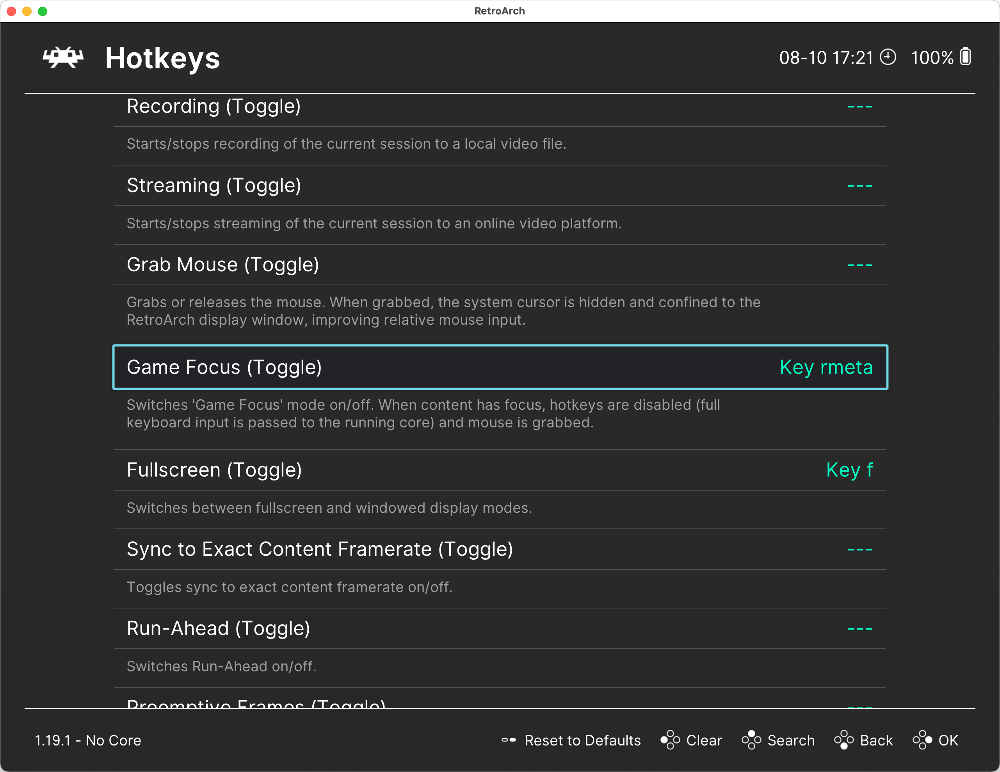

# Keyboard Controls

The RetroArch interface was initially designed for gamepad use, but it can also be operated using a keyboard.

> [!IMPORTANT]  
> You will need all these keys. Remember them!

- Use the arrow keys `↑`, `↓`, `←`, `→` to navigate through menu items.
  - To quickly scroll through long lists, use the left/right keys: `←`, `→`.
- Press `Enter` to open a menu item.
- Press `Backspace` to go back.
- Open the in-game menu with the `F1` key.
- Exit the program with the `Esc` key.
- Toggle fullscreen mode with the `F` key.
- Save the game state with `F2` and load a saved state with `F4` (see [Save and Load](../dosbox-pure/save-load.md#saving-and-loading-game-state-with-saveload-state)).

You can customize these hotkeys in the `Settings / Input / Hotkeys` section.

## Game Focus

Even if you don’t plan to customize hotkeys, you should definitely check which key is assigned to activate `Game Focus` mode and change it if needed.

When `Game Focus` mode is active, all key presses are passed directly to the emulator, not to RetroArch. **This is essential for the proper functioning of many DOS games and applications that use keyboard input.**

It's important to know how to activate and deactivate `Game Focus` mode.

You can configure RetroArch to automatically enable `Game Focus` mode for specific emulators that require it. To do this, go to `Settings / Input` and set `Auto-Enable Game Focus` to `Detect`.

> [!IMPORTANT]  
> In `Game Focus` mode, you won’t be able to use RetroArch hotkeys, such as `F1` for opening the menu.  
> To use these keys, you must first exit `Game Focus` mode.

The next step is to configure the [system folders](./folders.md).