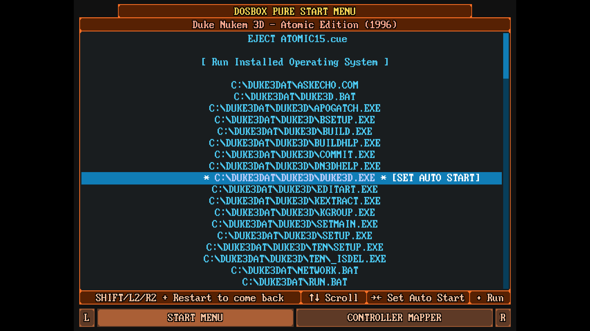

# Autostart

The autostart feature allows you to automatically launch a selected executable file when opening a game in `DOSBox Pure`.

With this feature enabled, you won't see the standard `DBP` menu and will be taken straight into the game.

To enable autostart for a specific game:

1. Launch the game. The standard `DBP` menu will open.
2. Move the cursor to the desired executable file.
3. Press the `→` (right arrow) key on your keyboard. Pressing the `←` (left arrow) key will disable autostart for the selected file.
4. The selected file will be marked with `SET AUTO START`.

## Disabling Autostart

To disable autostart for a game:

1. Launch the game.
2. Open the `Quick Menu` by pressing `F1`.
3. Select `Restart Content` while holding the `Shift` key on your keyboard.
4. This will open the `DBP` menu, where you can disable autostart for the selected file.