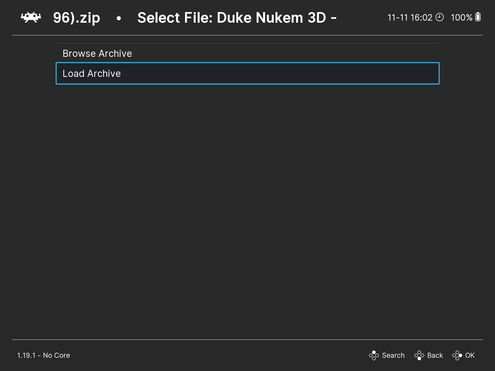

# Running Games

To run a game in DOSBox Pure, follow these steps:

1. Open the `Load Content` menu in RetroArch.  
   

2. Locate and select the archive containing the game, then choose `Load Archive`.  
     
   

3. If you have multiple cores installed, select the `DOSBox Pure` core.

You should then see the main `DBP` menu, which looks like this:  

At the top, you can see the `EJECT ….cue` option. This indicates that a `.cue` disk image was included in the archive and has been automatically mounted.

Below that, you can see a list of files and folders located on the `C:` drive. These are the files and folders from the archive that has been loaded.

> [!IMPORTANT]  
> Only executable files with extensions `.exe`, `.bat`, and `.com` are shown in this list. Other files in the archive are not displayed here.  
> If the game archive contains only one executable file, it will be launched automatically, and the `DBP` menu will not appear.

Use the `↑` and `↓` keys to navigate the menu, and press `Enter` to select an item.

At the bottom of the list, you can see executable files from the `D:` drive, which corresponds to the mounted disk image from the archive.

## Installing and Configuring Games

If your game version requires installation or configuration, you will see a file with a name like `install` or `setup` in this list.  
In such cases, it’s recommended to run this file first to complete the installation or setup process before launching the game’s main executable.  
The installation process can vary depending on the game.

> [!IMPORTANT]  
> Any changes made by the installer to the `C:` drive will be saved in a separate archive stored in the [Save Files](../retroarch/folders.md#save-files) folder.

To run the game, identify the main executable file, typically named after the game itself, and launch it by pressing `Enter`.