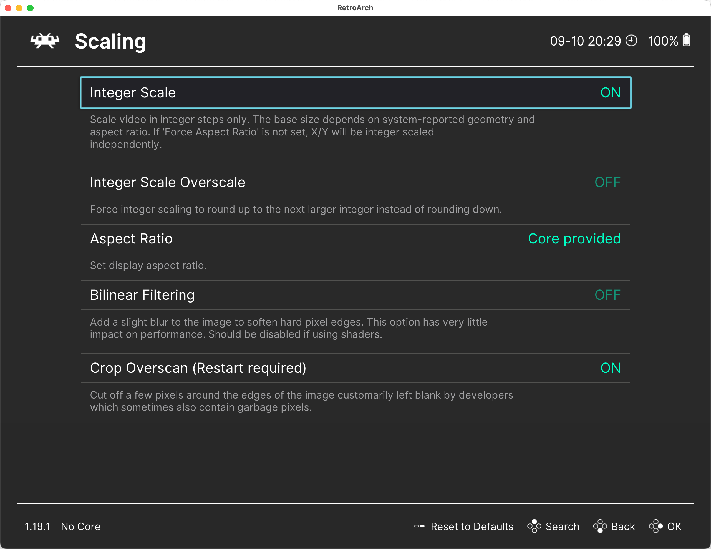

# Video Settings in RetroArch

Video settings in RetroArch can be found under the `Settings / Video` section.

Here are some settings that may be helpful when using DOSBox Pure:

- **Scaling**
  - `Integer Scaling` — It’s best to set this to `ON` to ensure sharp, clean pixels.
  - `Aspect Ratio` — Select `Core Provided`. This allows `DBP` to use the aspect ratio most suitable for the game being run.
- **Fullscreen Mode**
  - `Start in Fullscreen Mode` — Enabling this will make RetroArch start in fullscreen mode by default.
- **Windowed Mode**
  - `Windowed Scale` — Specify the scaling factor for windowed mode.
  - `Maximum Window Width / Height` — Set the maximum window size. When auto-scaling is used, the window will not exceed these dimensions.

## Note on Scaling

The scaling settings in RetroArch (`Windowed Scale`) work together with the 3D scaling settings in DOSBox Pure. For example, if you set scaling to `2x` in RetroArch and `3x` in DOSBox Pure, the image will ultimately be scaled by 6x — DOSBox renders the 3D scene at a higher resolution, and RetroArch further scales the resulting image.

This concludes the overview of RetroArch settings. Next, proceed to [installing DOSBox Pure](../dosbox-pure/install.md).