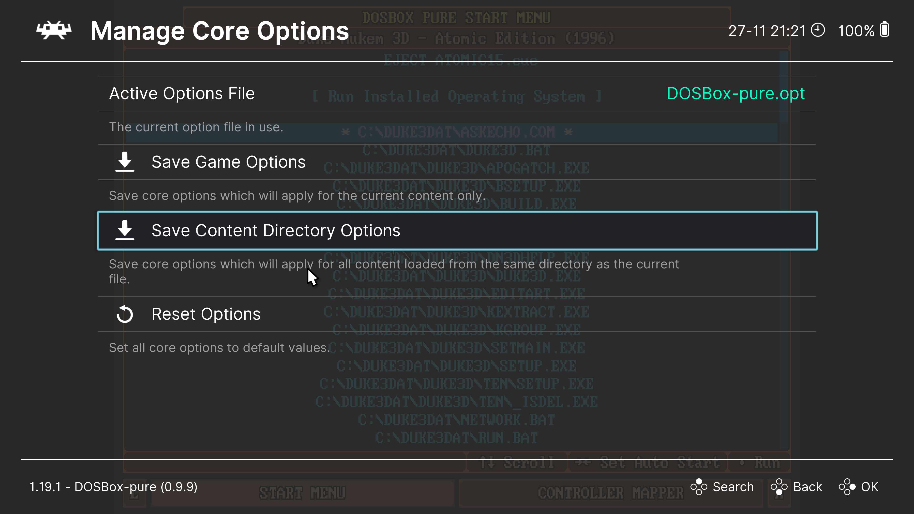

# Отдельные настройки для разных игр

Когда вы делаете какие-то настройки ядра `DOSBox-Pure`, например, выставляете количество циклов или выбираете видеорежим,
они применяются ко всем играм.

Но можно также сохранить настройки для каждой игры отдельно.

Для этого надо открыть меню `Quick Menu` во время игры (`F1`), перейти в раздел `Core Options` → `Manage Core Options`.

Здесь видно, какой файл с настройками используется для запущенной игры. По умолчанию это файл `DOSBox-pure.opt`.

Чтобы сохранить настройки для текущей игры, надо выбрать пункт `Save Game Options`. После этого текущие настройки будут 
сохранены в файле с названием запущенной игры (например, `Duke3D.opt`) в [папке с настройками](../retroarch/folders.md#configuration-files).

Удалить настройки для текущей игры можно, выбрав пункт `Remove Game Options`.

Также можно сохранить настройки для целой папки с играми. Это может быть удобно, если вы разложили игры по папкам,
которые соответствуют разным поколениям компьютеров (например, `8088`, `266`, `386` и т.д.). Для этого используйте пункт
`Save Content Directory Options`.