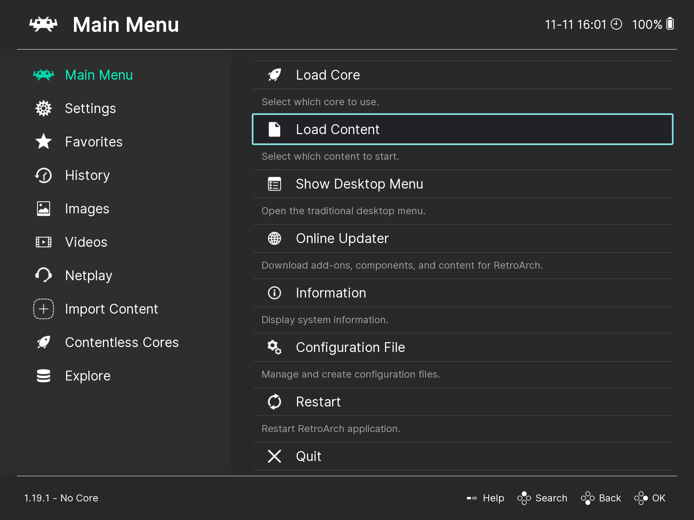
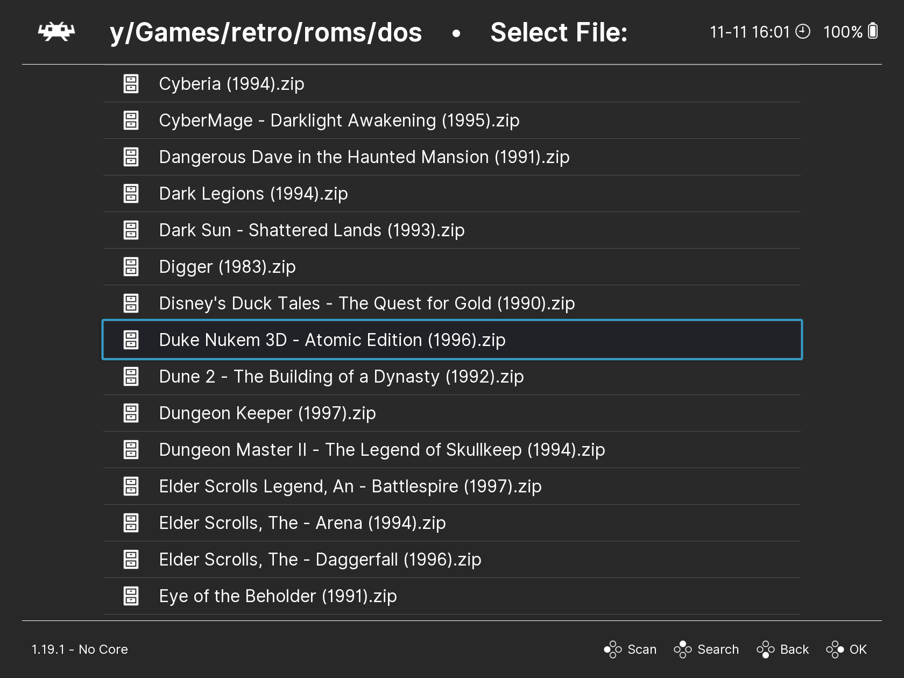
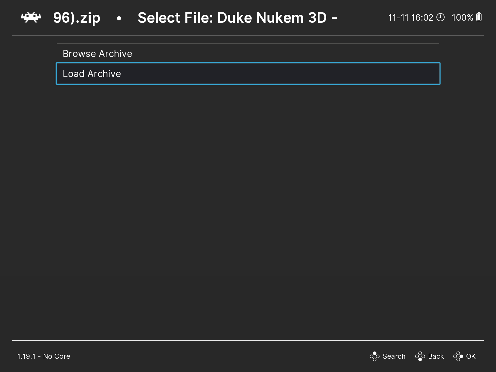
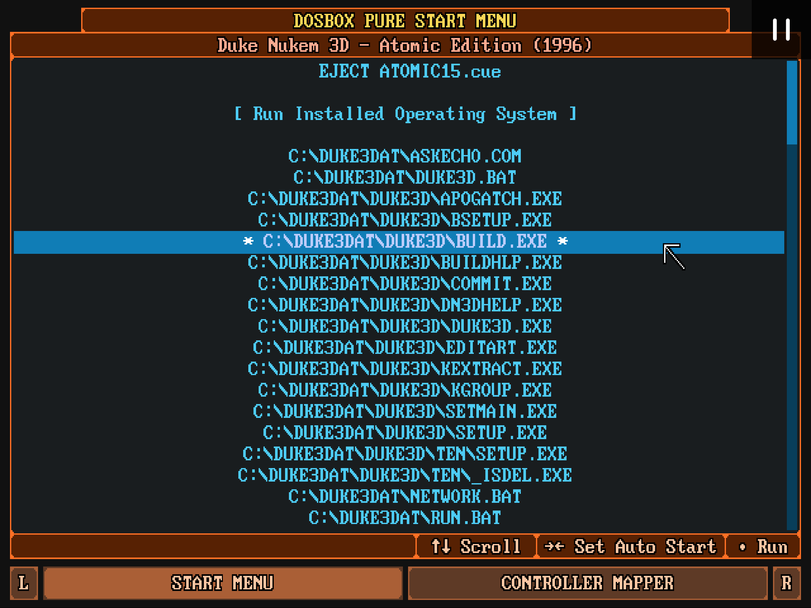
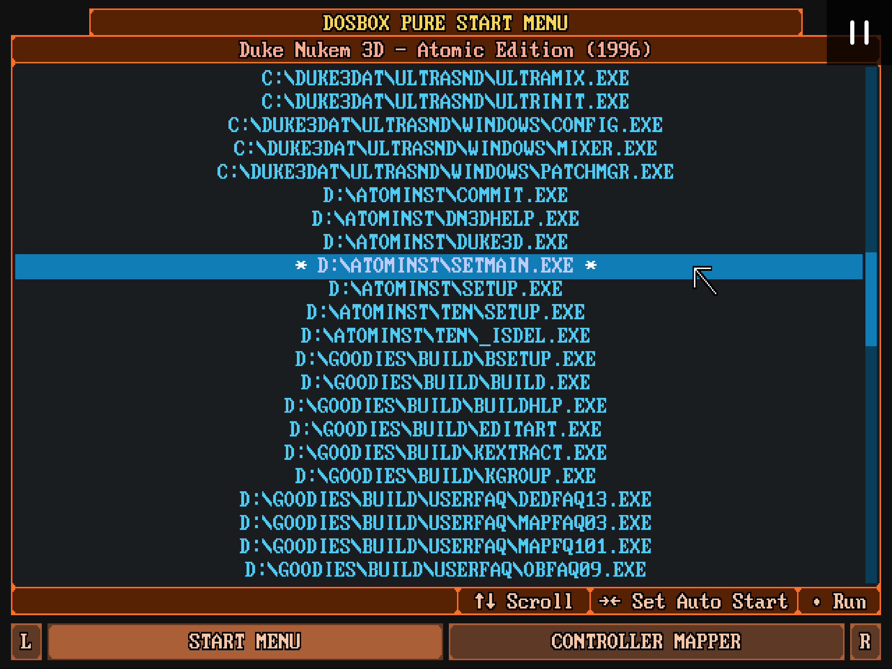

# Запуск игры

Для запуска игры в DOSBox Pure, вам нужно выполнить следующие шаги:

1. Открыть меню `Load Content` в RetroArch.
   

2. Найти и выбрать архив с игрой, затем выбрать `Load Archive`.
   
   

3. Если у вас установлено несколько ядер, то выбрать ядро `DOSBox Pure`.

После этого вы должны увидеть основное меню `DBP`, которое выглядит вот таким образом.

В верхней части мы видим пункт `EJECT ….cue`. Это говорит нам о том, что в архиве был образ диска с расширением `.cue`,
который был автоматически подключен.

Далее мы видим список файлов и папок, которые находятся на диске `C:`. Это файлы и папки из архива, который мы
запустили.

> [!IMPORTANT]  
> В этом списке показаны только исполняемые файлы с расширениями `.exe`, `.bat`, `.com`. На самом деле в архиве могут
> быть и другие файлы, просто они здесь не показываются.
> 
> Если в архиве с игрой есть только один исполняемый файл, то он будет запущен автоматически и меню `DBP` показано не будет.

Для перехода между пунктами меню используйте клавиши `↑`, `↓`. Чтобы открыть пункт меню, нажмите клавишу `Enter`.

В нижней части списка будут показаны исполняемые файлы с диска `D:`, то есть с подключенного образа диска из архива.

## Установка и настройки игр

Если ваша версия игры требует предварительной установки и настройки, то вы этом списке вы увидите файл с названием типа `install` или `setup`.
В этом случае рекомендуется сначала запустить этот файл, чтобы выполнить установку или настройку, а затем уже запускать основной исполняемый файл игры.
Процесс установки и настройки может отличаться для разных игр.

> [!IMPORTANT]
> Все изменения, которые установщик записывает на диск `C:` будут сохранены в отдельный архив, который лежит в папке [Saves](../retroarch/folders.md#save-files-и-save-states-).

Для запуска игры нужно понять, какой файл является основным исполняемым файлом. Обычно это файл с названием игры. Запустите его, нажав клавишу `Enter`.
