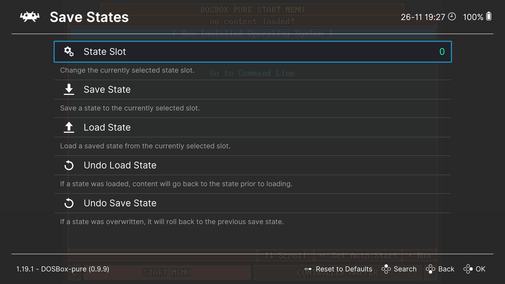

# Сохранение и загрузка

При запуске игр через `DBP` существует два способа сохранять и загружать игру:

1. Использовать стандартную функцию `Save/Load State`, которая есть в `RetroArch`.
2. Делать сохранения средствами самой игры. При этом `DOSBox-Pure` сохранит все изменения, который игра записывает на
   диск `C:`.

Категорически не рекомендуется комбинировать эти два способа. Рассмотрим их подробно.

## Сохранение и загрузка состояния игры с помощью функции Save/Load State

Это стандартная функция `RetroArch`, которая позволяет сохранять текущее состояние игры и загружать его позже.
Она работает не только с `DOSBox-Pure`, но и с другими эмуляторами.

В вашем распоряжении находится несколько слотов для сохранений, переключаться между которыми можно открыв `Quick Menu`
клавишей `F1`,
затем выбрав `Save States` → `State Slot`.

.

В том же меню `Save States` есть пункты `Save State` и `Load State`, которые позволяют сохранить текущее состояние игры
и загрузить сохранённое состояние.

Также можно назначить горячие клавиши для этих действий в настройках `Input` (см. [Управление с клавиатуры](../retroarch/keybinds.md)).

По умолчанию для этого используются клавиши `F2` и `F4`.

## Сохранение изменений на диске `C:`

Подавляющее большинство DOS-игр имею собственную функцию сохранения прогресса, которая записывает изменения на диск
`C:`.

Если вы запускали игру из `zip`-архива или из образа диска, то все изменения для этой игры будут сохранены в отдельный
архив, который лежит в папке [Saves](../retroarch/folders.md#save-files). Название этого архива будет полностью совпадать
с названием архива с игрой.

При желании, этот архив с сохранениями можно открыть и посмотреть, какие именно файлы были записаны на диск `C:`.

Обратите внимание, что в этот архив сохраняются **все** изменения, которые были записаны на диск `C:` после запуска ядра
`DOSBOX-Pure`. Это могут быть как сохранения игры, так и любые другие файлы, которые игра записывает на диск, в том числе
файлы конфигурации, логи и т.п.

> [!IMPORTANT]  
> Если игра была запущена не из архива, а из папки с распакованными файлами игры, то все изменения будут сохранены в
> эту же папку, а не в отдельный архив.
