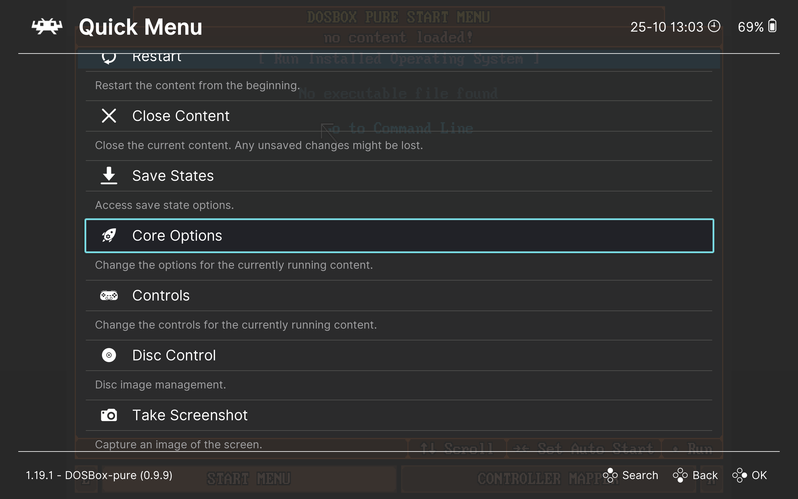

# Настройка DOSBox Pure

Открыть меню настройки `DBP` можно:

1. В любой момент во время игры.
2. Запустив ядро `DBP` без игры (в основном меню RetroArch выберите `Load Core` →  `DOSBox Pure`, затем `Start Core`).

В обоих случаях сначала нужно открыть внутриигровое меню RetroArch (`Quick Menu`), нажав `F1` на клавиатуре (не забудьте отключить `Game Focus`, если он включен), а затем выбрать раздел `Core Options`.

> [!TIP]  
> Если вы случайно вернулись в главное меню RetroArch, то вернуться во внутриигровое меню можно, выбрав пункт `Quick Menu`.

Рассмотрим все доступные настройки более подробно:

- [Настройка эмуляции](./settings/emulation.md)
- [Настройка ввода](./settings/input.md)
- [Настройка производительности](./settings/performance.md)
- [Настройка графики](./settings/video.md)
- [Системные настройки](./settings/system.md)
- [Настройка звука](./settings/audio.md)
