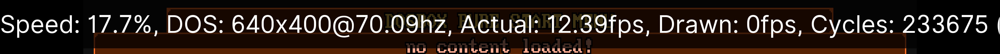

# Настройка эмуляции

Меню `Core Options` →  `Emulation` содержит общие настройки, связанные с эмуляцией.

## Force 60FPS Output

Принудительный вывод изображение с частотой 60 кадров в секунду. Включите, если возникают проблемы с вертикальной синхронизацией.

## Show Performance Statistics

Включает отображения статистики производительности вверху экрана. Есть два режима: простой и подробный.

## Save States Support

Включает поддержку сохранения и загрузки состояний игры, а также возможность перемотки назад. См. главу [Сохранение и загрузка](../save-load.md).

## Loading of dosbox.conf

Автоматическая загрузка файла с настройками `dosbox.conf` при запуске игры. Есть два варианта: загрузить файл `dosbox.conf` из папки или архива с игрой, либо загрузить `.conf` с тем же название, что и игра. По умолчанию отключено.

## Start Menu

Здесь можно выбрать, когда будет показано начальное меню DOSBox Pure. По умолчанию оно показывается при старте ядра (до запуска игры), и после выхода их игры.

## Input Latency

Настройки для устранения задержек ввода. Требует дополнительной ручной настройки, так что используйте его только если заметили проблемы с задержками.