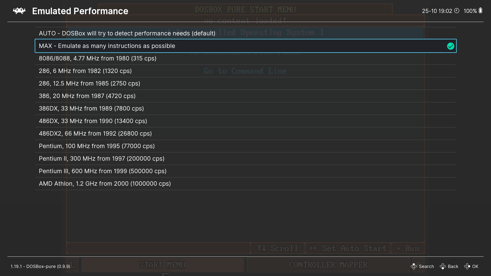

# Настройка производительности

Меню `Core Options` → `Performance` содержит настройки, связанные с производительностью в играх.

Они пригодятся, если игра работает слишком медленно или слишком быстро.

## Emulated Performance

Здесь можно выбрать, насколько быстрый компьютер будет эмулироваться. Можно выбрать вручную из предложенных вариантов, либо использовать один из особых режимов.

### AUTO

В этом режиме эмулятор будет пытаться автоматически подстроить скорость под требования запущенной игры.

### MAX

Максимально возможная скорость эмуляции. Фактическая скорость будет зависеть от производительности вашего процессора в однопоточном режиме.

## Maximum Emulated Performance

Здесь можно задать верхний предел скорости эмуляции, который будет использоваться в режимах `AUTO` и `MAX`.

## Limit CPU Usage

Задать ограничение на нагрузку процессора. Полезно, если эмулятор слишком сильно нагружает систему.