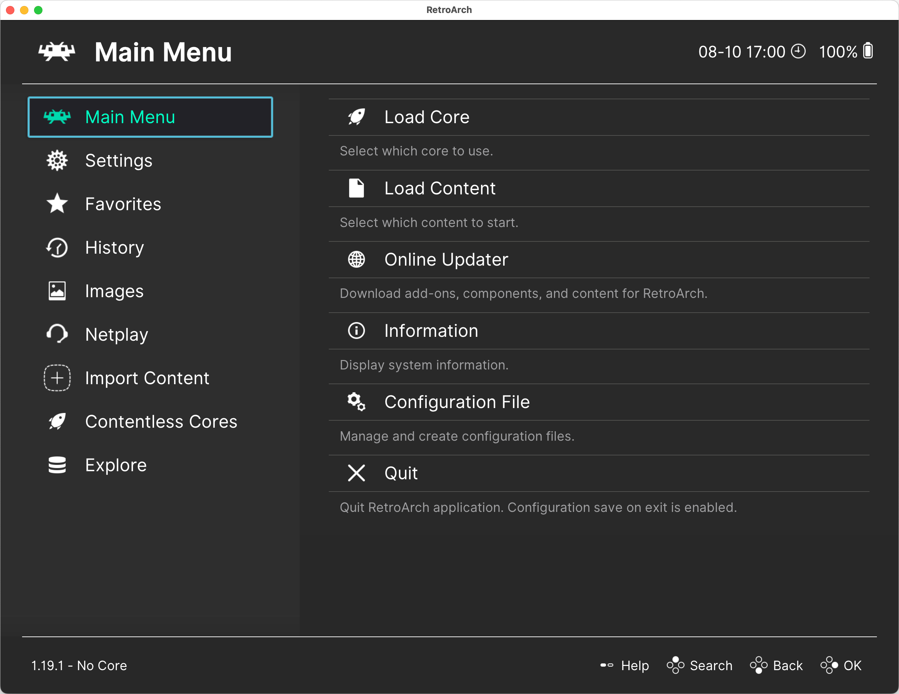

# Установка RetroArch

RetroArch — это программа для запуска различных эмуляторов. Эмуляторы в RetroArch называются ядрами.

Существует версии RetroArch для различных платформ: Windows, Linux, macOS, Android, iOS, PlayStation, Xbox и других.

Скачать установочный файл RetroArch можно на [официальном сайте в разделе загрузок](https://retroarch.com/?page=platforms).

Также его можно установить из [Steam](https://store.steampowered.com/app/1118310/RetroArch/).

После установки и запуска вы увидите вот такое окно:

Если вы запускаете RetroArch на компьютере, то стоит разобраться с [управлением с клавиатуры](./keybinds.md).