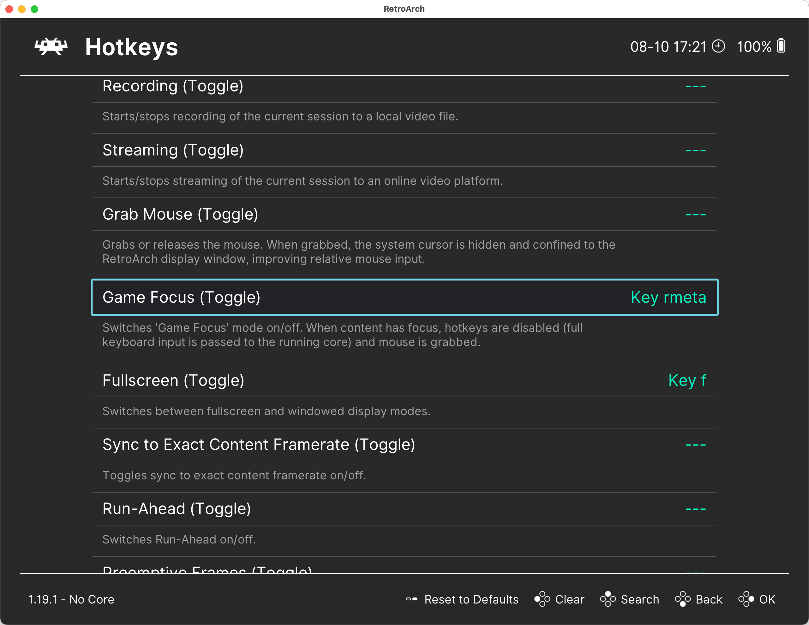

# Управление с клавиатуры

Интерфейс RetroArch изначально был разработан для управления с геймпада, но им также можно пользовать и с помощью клавиатуры.

> [!IMPORTANT]  
> Все эти клавиши вам пригодятся. Запомните их!

- Для перемещения между пунктами меню используется курсоры: `↑`, `↓`, `←`, `→`.
  - Чтобы быстро прокрутить длинный список, нажимайте клавиши вправо/влево: `←`, `→`.
- Чтобы открыть пункт меню, нажмите клавишу `Enter`.
- Чтобы вернуться назад, нажмите клавишу `Backspace`.
- Внутриигровое меню открывается клавишей `F1`.
- Выход из программы — клавиша `Esc`.
- Перейти в полноэкранный режим — клавиша `F`. Она же — выход из полноэкранного режима.
- `F2` — сохранить состояние игры, `F4` — загрузить сохранённое состояние (см. [Сохранение и загрузка](../dosbox-pure/save-load.md#Сохранение-и-загрузка-состояния-игры-с-помощью-функции-saveload-state)).

Горячие клавиши можно настроить под себя в разделе `Settings / Input / Hotkeys`.

## Game Focus

Даже если вы не собираетесь настраивать горячие клавиши, вам нужно обязательно посмотреть, какая клавиша
используется для активации режима `Game Focus`, и, при необходимости, поменять её.

Когда активен режим `Game Focus`, все нажатия клавиш передаются внутрь эмулятора, а не в RetroArch. **Это необходимо для
нормальной работы многих DOS-игр и приложений, в которых используется управление с клавиатуры.**

Поэтому важно знать, как активировать и деактивировать режим `Game Focus`.

Вы можете настроить RetroArch, чтобы он автоматически активировал режим `Game Focus` для тех эмуляторов, в которых это 
необходимо. Для этого перейдите в раздел `Settings / Input` и переключите `Auto-Enable Game Focus` в режим `Detect`.

> [!IMPORTANT]  
> В режиме `Game Focus` вы не сможете пользоваться горячими клавишами RetroArch, такими как `F1` для открытия меню.
> Чтобы эти клавиши заработали, сначала нужно выйти из режима `Game Focus`.

Следующее, на что стоит обратить внимание после установки RetroArch — это настройка [системных папок](./folders.md).