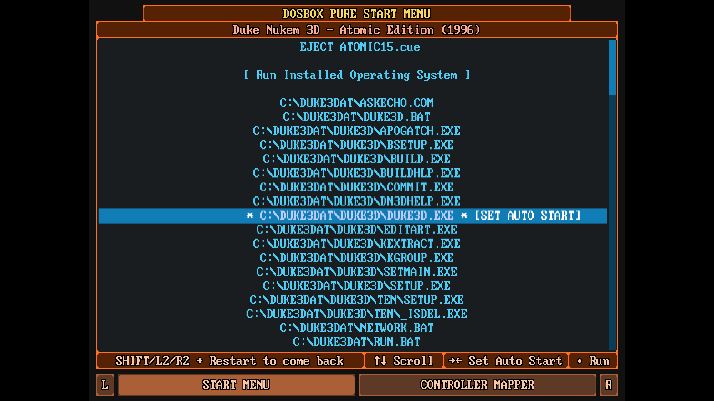

# Автозапуск

Функция автозапуска позволяет автоматически запустить заранее выбранный исполняемый файл при открытии игры через `DOSBox-Pure`.

В этом случае вы не увидите стандартной меню `DBP`, а сразу попадёте в игру.

Чтобы активировать автозапуск для конкретной игры, нужно:

1. Запустить игру. При этом откроется стандартное меню `DBP`.
2. Перемести курсор на нужный исполняемый файл.
3. Нажать клавишу `→` (стрелка вправо на клавиатуре). Клавиша `←` (стрелка влево) отключит автозапуск для выбранного файла.
4. При этом для выбранного файла появится пометка `SET AUTO START`

## Отключение автозапуска

Чтобы отключить автозапуск для игры, нужно:

1. Запустить игру
2. Открыть меню `Quick Menu` (`F1`)
3. Выбрать пункт `Restart Content`, удерживая клавишу `Shift` на клавиатуре.
4. При этом будет открыто меню `DBP`, в котором вы можете отключить автозапуск для нужного файла.

