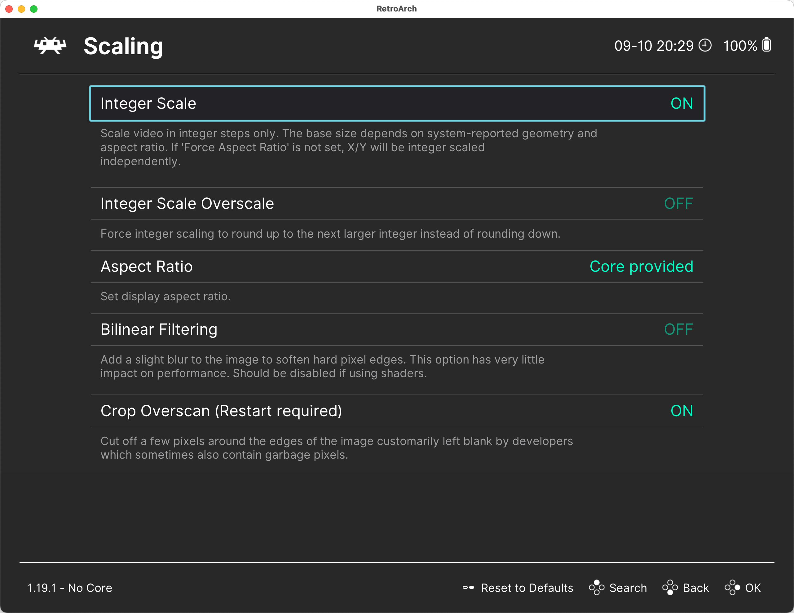

# Настройка графики в RetroArch

Настройки графики в RetroArch можно найти в разделе `Settings / Video`.

Вот несколько настроек, которые могут вам пригодиться при работе с DOSBox Pure:

- `Scaling`
  - `Integer Scaling` — здесь лучше всего выставить `ON`, чтобы пиксели были чёткими.
  - `Aspect Ratio` — выберите `Core Provided`. В этом случае `DBP` будет использовать соотношение сторон, 
    которое лучше всего подходит для запущенной игры.
- `Fullscreen Mode`
  - `Start in Fullscreen Mode` — если включить, то RetroArch будет запускаться сразу в полноэкранном режиме.
- `Windowed Mode`
  - `Windowed Scale` — здесь можно указать степень масштабирование при игре в оконном режиме.
  - `Maximum Windows Width / Height` — здесь задаются максимальные размеры окна. При автоматическом масштабировании 
    окно не будет больше этих размеров.

Обратите внимание, что настройки масштабирования в RetroArch (`Windowed Scale`) используются совместно с настройками
масштабирования 3D в DOSBox Pure. То есть если вы установили масштабирование `2x` в RetroArch, а в DOSBox Pure — `3x`, то
в итоге изображение будет увеличено в 6 раз – DOSBox рендерит трёхмерную сцену в более высоком разрешении, а затем 
RetroArch дополнительно увеличивает получившуюся картинку.

На этом обзор настроек RetroArch завершён. Теперь можно переходить к [установке DOSBox Pure](../dosbox-pure/install.md).